Saving xlsx to csv, and reading data in R.

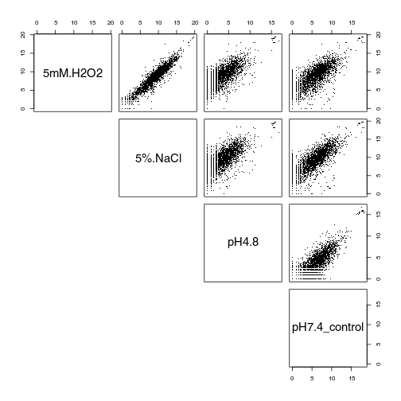 

Creating a DESeqDataSet object and sample desription


```
## Loading required package: S4Vectors
## Loading required package: stats4
## Loading required package: BiocGenerics
## Loading required package: parallel
## 
## Attaching package: 'BiocGenerics'
## 
## The following objects are masked from 'package:parallel':
## 
##     clusterApply, clusterApplyLB, clusterCall, clusterEvalQ,
##     clusterExport, clusterMap, parApply, parCapply, parLapply,
##     parLapplyLB, parRapply, parSapply, parSapplyLB
## 
## The following object is masked from 'package:stats':
## 
##     xtabs
## 
## The following objects are masked from 'package:base':
## 
##     anyDuplicated, append, as.data.frame, as.vector, cbind,
##     colnames, do.call, duplicated, eval, evalq, Filter, Find, get,
##     intersect, is.unsorted, lapply, Map, mapply, match, mget,
##     order, paste, pmax, pmax.int, pmin, pmin.int, Position, rank,
##     rbind, Reduce, rep.int, rownames, sapply, setdiff, sort,
##     table, tapply, union, unique, unlist, unsplit
## 
## Creating a generic function for 'nchar' from package 'base' in package 'S4Vectors'
## Loading required package: IRanges
## Loading required package: GenomicRanges
## Loading required package: GenomeInfoDb
## Loading required package: Rcpp
## Loading required package: RcppArmadillo
```

Normalization

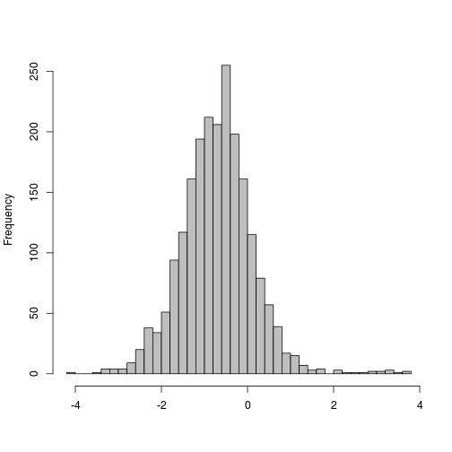 

Make a matrix of log normalized counts (plus a pseudocount)


Examine the log counts and the log normalized counts (plus a pseudocount)

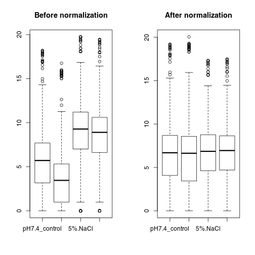 

Stabilizing count variance


The principal components (PCA) plot is a useful diagnostic for examining relationships between samples

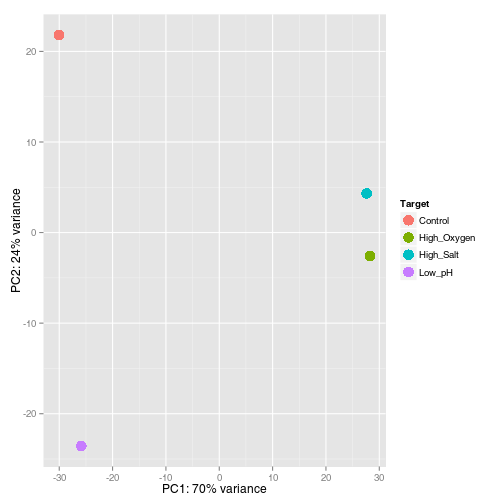 

The hierarchical clustering based on Euclidean distance matrix

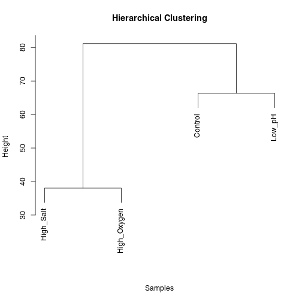 

## Differential gene expression
Experimental design and running DESeq2


```
## using pre-existing size factors
## estimating dispersions
```

```
## Warning in checkForExperimentalReplicates(object, modelMatrix): same number of samples and coefficients to fit,
##   estimating dispersion by treating samples as replicates.
##   read the ?DESeq section on 'Experiments without replicates'
```

```
## gene-wise dispersion estimates
## mean-dispersion relationship
## final dispersion estimates
## fitting model and testing
```

VennDiagram & Heatmap


```
## Loading required package: grid
```

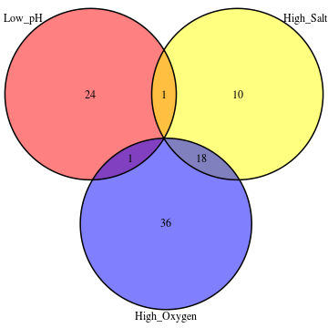 

```
## (polygon[GRID.polygon.80], polygon[GRID.polygon.81], polygon[GRID.polygon.82], polygon[GRID.polygon.83], polygon[GRID.polygon.84], polygon[GRID.polygon.85], text[GRID.text.86], text[GRID.text.87], text[GRID.text.88], text[GRID.text.89], text[GRID.text.90], text[GRID.text.91], text[GRID.text.92], text[GRID.text.93], text[GRID.text.94])
```


```
## Error in check.length("fill"): 'gpar' element 'fill' must not be length 0
```

```
## Error in check.length("fill"): 'gpar' element 'fill' must not be length 0
```

```
## Error in check.length("fill"): 'gpar' element 'fill' must not be length 0
```

GO&KEGG analysis


```
## Loading required package: XLConnectJars
## XLConnect 0.2-11 by Mirai Solutions GmbH [aut],
##   Martin Studer [cre],
##   The Apache Software Foundation [ctb, cph] (Apache POI, Apache Commons
##     Codec),
##   Stephen Colebourne [ctb, cph] (Joda-Time Java library)
## http://www.mirai-solutions.com ,
## http://miraisolutions.wordpress.com
```

 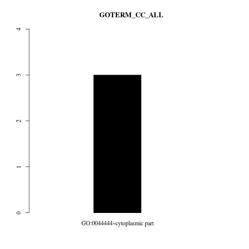 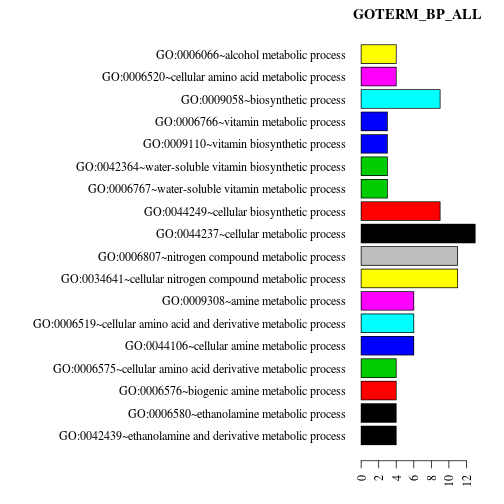 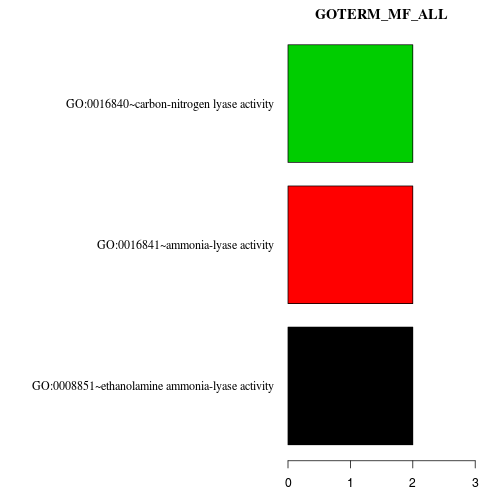 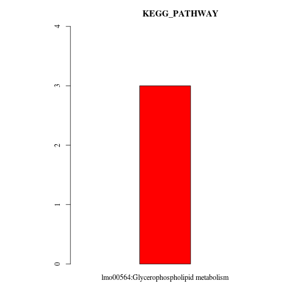 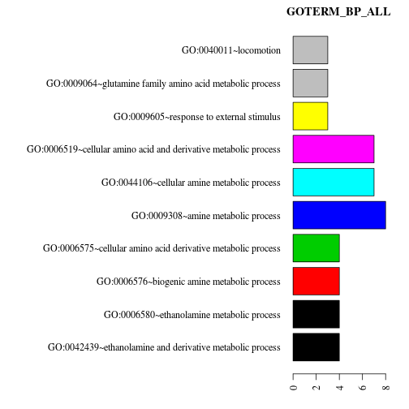 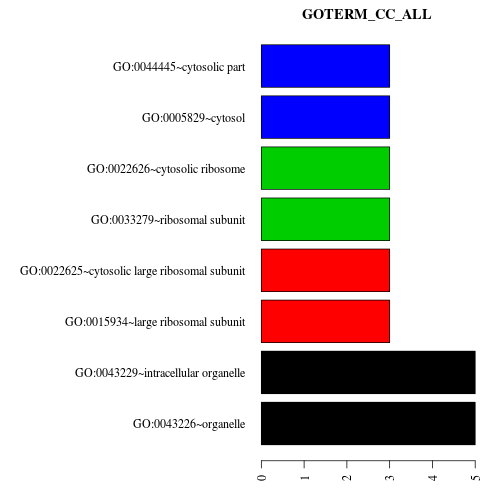 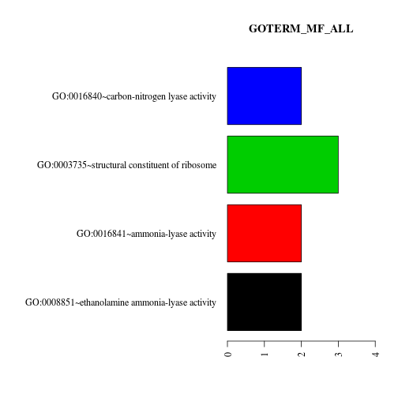 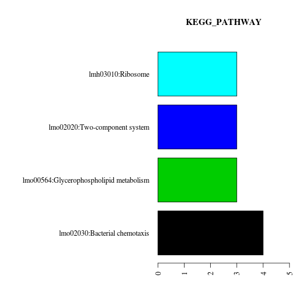 
